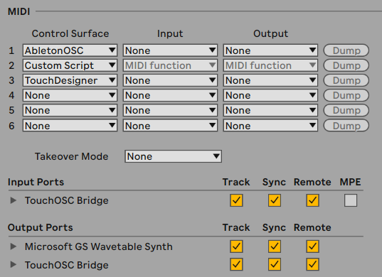
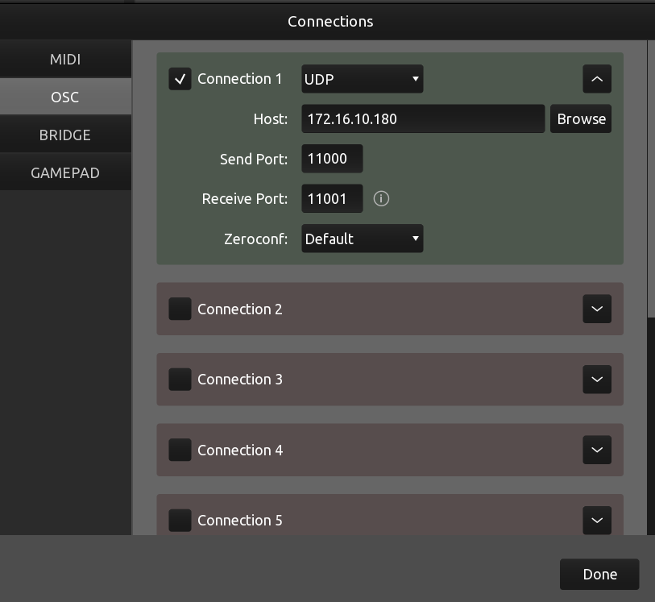
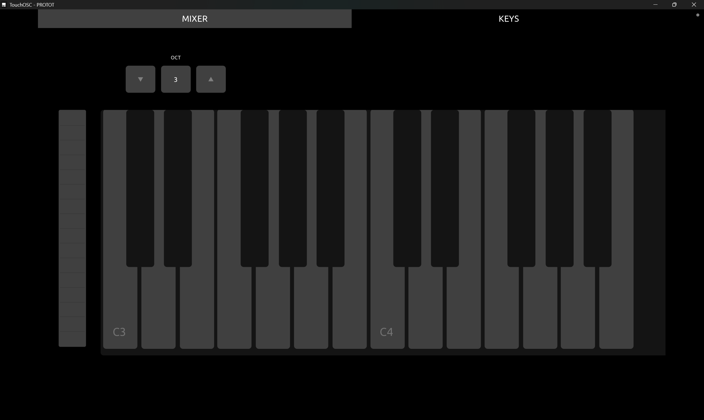
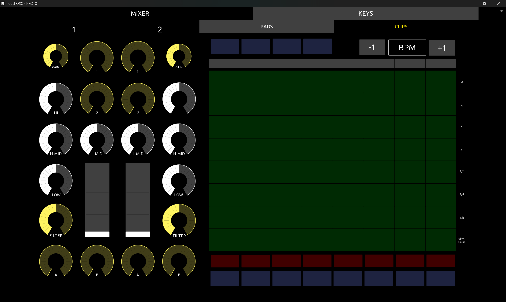
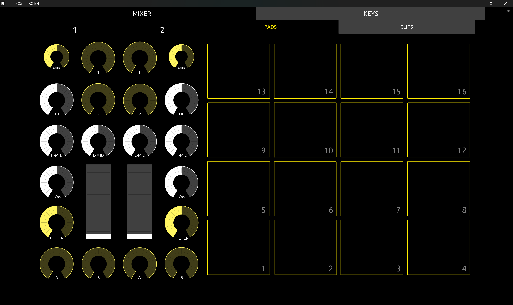

# TouchOSC Control Surface for Ableton Live

Designed to control **Ableton Live** for DJing (Madeon launchpad DJ style) including clip launch, mixer, drum pads, BPM control and some free buttons (Control Resolume Arena) via OSC and MIDI

## Repository Structure

* **`ControlSurface.tosc`**: The layout file for the TouchOSC app.
* **`Live Template`**: Live project template for DJing.
    * `Template.als`: The Live Set file.
* **`Custom_Script`**: Custom Python control surface scripts for Live.

## Prerequisites

1.  **[TouchOSC](https://hexler.net/touchosc)** ($19.99) is installed on your tablet/phone.
2.  **Ableton Live**.
3.  **[AbletonOSC](https://github.com/ideoforms/AbletonOSC)**: Required to handle the OSC communication.

## Installation & Setup

### 1. Install the Remote Script
1.  Download and install **AbletonOSC** and **Custom_Script** into your Ableton Remote Scripts folder.
    * *Windows*: `\ProgramData\Ableton\Live x.x\Resources\MIDI Remote Scripts\`
    * *Mac*: `/Applications/Ableton Live x.x.app/Contents/App-Resources/MIDI Remote Scripts/`
2.  Restart Live.

### 2. Configure Ableton Live
1.  Open **Ableton Live**.
2.  Go to **Preferences** > **Link/Tempo/MIDI**.
3.  Add `AbletonOSC` as a Control Surface.
4.  Add `Custom_Script` as a Control Surface and select Input and Output: `"TouchOSC Bridge"` or `"MIDI function"` based on your connection method. 

5.  Open the provided template file:
    * Go to `File` > `Open Live Set...`
    * Select `Live Template/Template.als` from this repository.

### 3. Configure TouchOSC
1.  Open **TouchOSC** on your device (iPad/Android/Desktop).
2.  Open the `.tosc` file:
    * Transfer `ControlSurface.tosc` to your device.
    * Open it in the TouchOSC.
3.  Set up the **OSC Connection** (On your tablet):
    * **Host (Send Port)**: IP address of your computer running Live (e.g., `192.168.x.x`). You can find it by typing `ipconfig` in terminal. 
    * **Port (Outgoing)**: `11000` (Default for AbletonOSC).
    * **Port (Incoming)**: `11001` (Default for AbletonOSC).

4.  Set up the **MIDI Connection**:
    * Select your TouchOSC Bridge or MIDI interface. On Android, you can choose `MIDI option` directly in the notification bar when plug it in to your computer.
    * Add TouchOSC Bridge or MIDI interface to the **MIDI** section. 
 

## Features
* **Track Header Color Sync**:
    * Sync track headers with Live color 
* **BPM changing**:
    * Change BPM on your surface control via OSC.
* **Mixer Controls**:
    * EQ adjustment & FX for 2 decks.
* **Clip triggering**:
    * Trigger clips on your surface control via MIDI.
* **Drum Pads and Piano Keys**:
    * From TouchOSC default templates.

